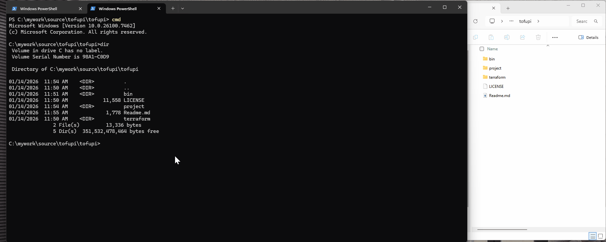

## TofuPi

TofuPi 是一个声明式terraform 框架，其摒弃复杂的代码式脚本编写，仅通过一个yaml格式声明参数配置，就可快速实现terraform 脚本的创建。单一yaml文件的描述，让使用者更容易维护terrfaorm 创建的资源，使用者可更专注目标资源的管理和使用。封装的资源模块，即可最大发挥terraform的强大功能，又可让使用者共享资源厂商的最佳实践。

TofuPi 的核心目标是简化 Terraform 配置的编写、复用及维护，强化声明式范式，不需要编程逻辑，即可快速完成相关infra资源的创建及更新，解决原生 Terraform 在大规模场景下的复用性、模块化、状态管理等痛点。

## 特点
* 无需复杂编程
* 所有配置，一目了然
* 多项目管理
* 多环境管理
* 安全密钥加密，对敏感字符串安全加密
* 符合 gitops 规范
* 更易于集成 pipeline
* 云上资源一键导出，可直接使用
* 扩展字段支持
  * 模块中定义的变量，可在import 阶段被自动提取

## 演示
* import 阶段

* apply 阶段


## 快速开始
* 注意1：目前仅支持aws 的资源导入及配置，更多场景还在开发中，敬请期待
* 注意2：依赖外网
* 工具依赖
  * opentofu
    * https://github.com/opentofu/opentofu/releases
  * terraformer
    * https://github.com/GoogleCloudPlatform/terraformer/releases
  * 在windows 环境下，需要将 terraformer.exe 及 tofu.exe 放到 PATH 环境变量中, 也可放在bin目录中

* 创建 aws 认证
```shell
## 配置 aws 配置文件
### 创建 dev 配置 AKIAI44XXXXXXXX  及  je7MtGbClwBXXXXXXXXXXXXXXXXXXXXXXXXXXXX
aws configure --profile dev <<EOF
AKIAI44XXXXXXXX
je7MtGbClwBXXXXXXXXXXXXXXXXXXXXXXXXXXXX
us-east-2
json
EOF 
```
* 开始

```shell
## 初始化目录
tofupi init <project> # or .
cd <project>

## 导入现有资源 导入 aws s3 资源, 会生成 aws_terraform.tfstate 到 project 目录
tofupi import aws -r s3,ssm -p dev -g dev -P test

## 导出资源会存在env_import.yaml 中，用户可根据此文件选取复制到env.yaml，然后执行apply 即可创建terraform 配置文件

## 创建terraform 配置文件
tofupi apply aws -P test -g dev

## 部署terraform
tofu init
tofu plan -var-file dev.tfvars -out plan.out
tofu apply "plan.out"

```

## 配置说明
### 模块说明
模块配置文件位于 terraform/modules/aws 目录下，每个模块对应一组资源类型，例如
* aws-alb 对应 AWS Application Load Balancer 相关资源
* 模块中默认是获取terrfaorm 资源名称的第二个字符段作为资源名称，例如 aws_ecr_repository 的资源名称为s3, 若不符合默认规则，则通过.aws.yaml 中配置资源名与模块名的对应关系。
* 模块中变量名称与资源参数名称一致，变量类型与资源参数类型一致, 例如 aws_ecr_repository 模块中定义了变量 name 与 aws_ecr_repository 资源的 name 参数一致，且类型为 string。
* 模块中增加了 _tofupi 参数，变量类型为map 类型，第一层为该模块中管理的资源名称，第二层为该资源的相关操作参数。该参数提供了更丰富的资源定义能力，其子参数如下：
  * nameKey 参数，默认值为 name, 定义资源名称的来源，例如 aws_security_group 模块中定义了 nameKey = "id"，表示资源名称来自于 aws_security_group 资源的 id 参数的值。
  * link 参数，定义资源间的关联关系，无默认值，link 定义格式为 主资源名称.关联变量名称.关联资源属性名.主资源属性名，
    * 例如 aws_security_group.sg_rules.security_group_id.id 定义 link = 主资源名称.关联变量名称.关联资源属性名.主资源属性名，表示 aws_security_group_rule 中的 security_group_id 变量的值与 主资源 aws_security_group 的 id 的值相同，并具有关联性。
  * projectID 参数, 定义资源所属的项目ID，无默认值，导入时会根据 projectID 的值进行资源分类。
  * policy参数，无默认值，定义该资源中的 policy 内容指定的字段的内容是否改写为policy 文件, 内容必须是json格式，并将该参数重定义为 policy_file 参数。
  * exclude参数，无默认值，定义导入该资源时排除的参数，若exclude 的值是个list。
    * 例如 aws_s3_bucket 模块中定义了 exclude = ["acl"]，表示在导入 aws_s3_bucket 资源时排除 acl 参数。

### env.yaml 说明

所有的terraform 配置都通过 env.yaml 文件进行定义，env.yaml 文件位于 project/<项目名>/ 目录下，env.yaml 文件中的结构说明如下：
* yaml 层级为 声明分类 -> 模块名称 -> 资源名称 -> 资源参数
* 声明分类有default 和项目名称两种，default 分类下的配置为所有项目的默认参数，项目名称则声明了其包含infra资源的所属项目。
* default下可定义all、dev、cert、prod层级，其对应的是 命令行参数 -g 的值，表示该参数适用于所有项目的对应环境，all 层级的参数将会被其他层级覆盖。 例如 default 下的 dev 层级的参数适用于所有项目的 dev 环境。all及dev所有参数会被生成到terraform 的 dev.tfvars 文件中。
* 项目名称下的default 则为该项目的默认参数，其将覆盖上层中default的同名参数配置。
* 资源名称为各模块具体实例的名称，默认为name参数的值，若模块中定义了 nameKey 参数，则为 nameKey 定义的参数值，例如 aws_security_group 模块中定义了 nameKey = "id"，则资源名称为 aws_security_group 资源的 id 参数的值。
* 资源参数为 terraform 资源的参数配置，参数名称与模块中定义的变量名称一致，参数值为该参数的值，例如 aws_s3_bucket 模块中定义了 name 变量，则在 env.yaml 中配置该资源时，参数名称为 name，参数值为该资源的 name 参数的值。
* 导入资源时，会先生成一个 env_import.yaml 文件，文件结构与 env.yaml 文件一致，导入的资源会被分类到对应的项目名称中，其中被exclude定义的及与模块中参数默认值一致的参数将不会被导入到 env_import.yaml 文件中，用户可根据需要将 env_import.yaml 文件中的资源参数复制到 env.yaml 文件中进行最后使用。


## Star 统计


